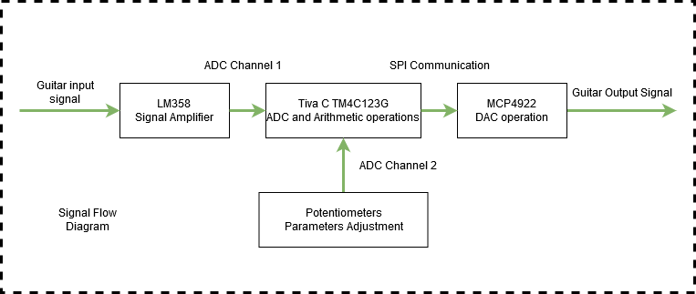
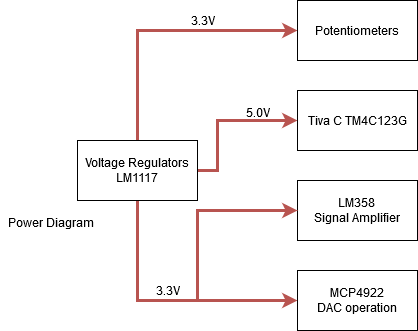

# DIY-Guitar-Distortion-Pedal
Basic distortion guitar pedal using several popular waveshapers

Demo video: 
https://www.youtube.com/watch?v=Nku1Rf1OrVk

Hardware:
- Tiva C tm4c123g
- MCP4921
- LM358P
- 3.3 and 5.0v LM1117

Signal and Power Diagram:

